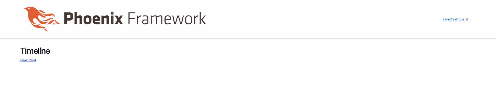
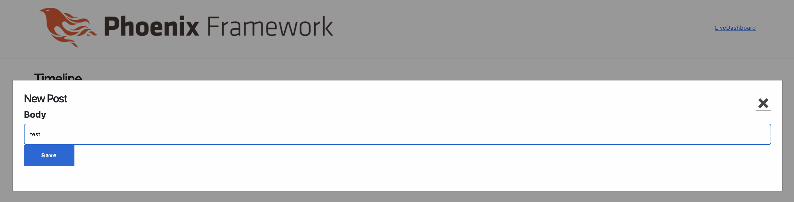
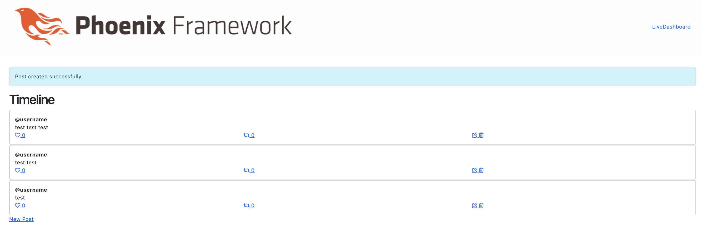
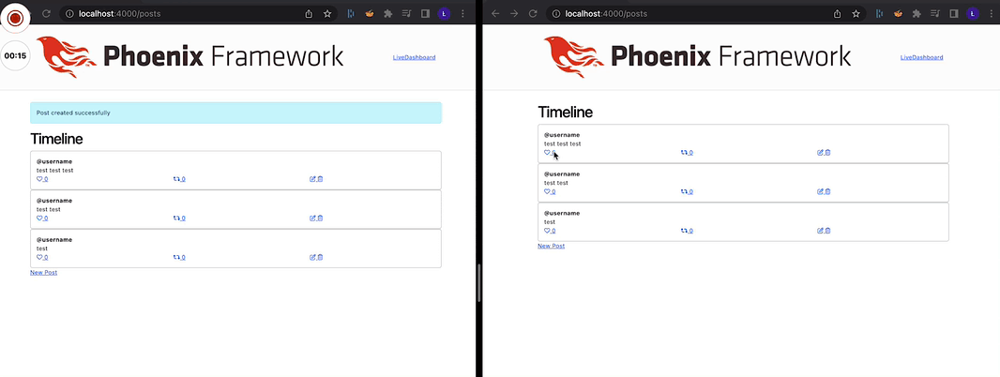
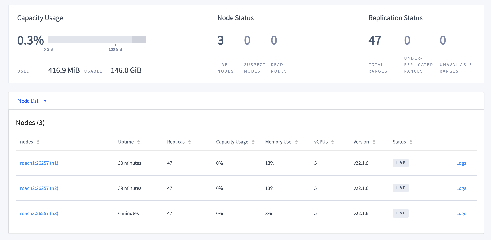
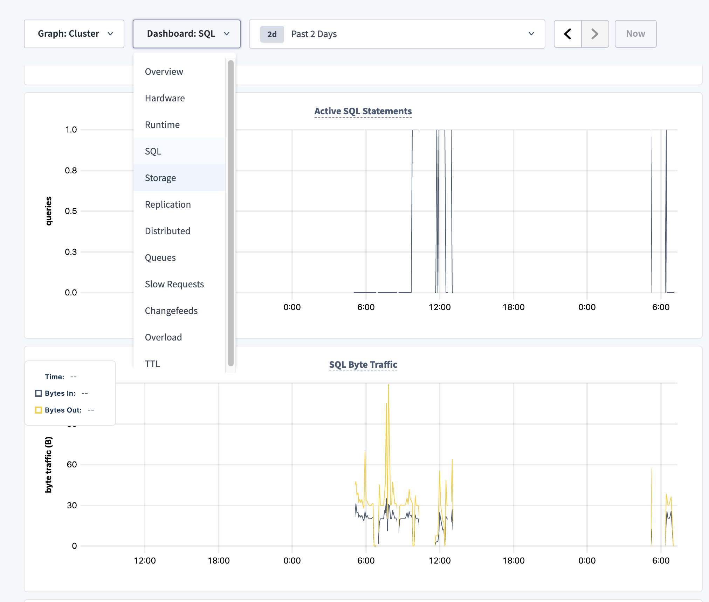
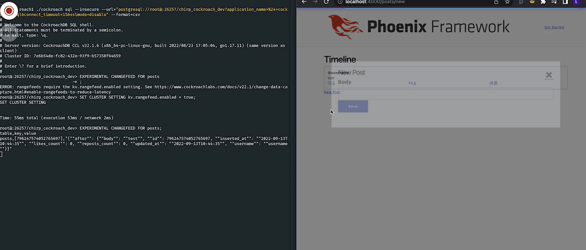

# ChirpCockroach

## Overview
The goal of this demo is to showcase the usage of CockroachDB together with a Phoenix LiveView application,
provide basic guidelines for integration and examples of a more advanced configuration of the database itself
and how to deploy it using tools that are commonly used in production (e.g. Kubernetes, Podman).
**NOTE** This demo uses 3 node cluster to simulate features such as replication and what happens
if one of the nodes is down. This is not ideal as sometimes containers might crash as a result of running 3 of them
on one machine.

### Important
As of now (13.09.2022) CockroachDB does not have binaries/homebrew formulas for Macbooks with M1/M2
processors please use Docker to run images for CockroachDB.

### Requirements
For setting up a demo using Phoenix development server you need to have Elixir and Erlang installed.
The easiest way to install all dependencies is to use a package manager. This project provides the needed package
versions in file the `.tool-versions` file used by `asdf` package manager. To install the packages run:
```bash
$ asdf install
```
Docker and docker-compose are assumed to be installed on the machine, and packages required for [DevOps examples](##DevOps Examples)
are also specified in the `.tool-versions` file.

## What is CockroachDB?
CockroachDB is a distributed SQL database built on a transactional and strongly-consistent key-value store.
It scales horizontally; survives disk, machine, rack, and even data center failures with minimal latency disruption
and no manual intervention; supports strongly-consistent ACID transactions;  and provides a familiar SQL API
for structuring, manipulating, and querying data.

To read more check out the official [documentation](https://www.cockroachlabs.com/docs/).

## Phoenix and Phoenix LiveView
The application is built according to [this](https://www.youtube.com/watch?v=MZvmYaFkNJI) YouTube tutorial. It's a clone of some basic Twitter features that allow showcasing some
Phoenix LiveView features, all powered by Elixir/Phoenix backend.

## Phoenix app and CockroachDB connection.
With Ecto >= 3.8 and postgrex >= 0.15 there is no need for any additional dependencies to connect the Phoenix app with CockroachDB.
Configuration is similar to normal PostgreSQL database setup.
Developers can provide database connection information as a list of keys:
```Elixir
# ~/config/dev.exs
config :chirp_cockroach, ChirpCockroach.Repo,
  username: "root",
  password: "",
  hostname: "localhost",
  port: 26257,
  database: "chirp_cockroach_dev",
  stacktrace: true,
  show_sensitive_data_on_connection_error: true,
  pool_size: 10,
  migration_lock: false
```
or as database URL:
```elixir
  # ~/config/runtime.exs
  maybe_ipv6 = if System.get_env("ECTO_IPV6"), do: [:inet6], else: []

  # example database_url: "postgresql://root@roach1:26257/chirp_cockroach_dev?sslmode=disable"
  config :chirp_cockroach, ChirpCockroach.Repo,
    # ssl: true,
    url: database_url,
    pool_size: String.to_integer(System.get_env("POOL_SIZE") || "10"),
    socket_options: maybe_ipv6,
    migration_lock: false
```
### Important notes
- CockroachDB does not support locking tables so we need to manually disable it by adding `migration_lock: false`
- the configuration above uses default values, but it's possible (and recommended) to enable `ssl` for a production database

## Basic setup using docker-compose
### Requirements
- Docker
- docker-compose

### First/fresh run
In case of a first start of the service or in case volumes were cleared database needs to be created
```bash
$ docker exec -it roach1 ./cockroach sql --insecure
> CREATE DATABASE chirp_cockroach_dev;
```

Start containers:
```bash
$ docker-compose up
```

This will create 4 containers:
- roach1, roach2, roach3 - CockroachDB nodes
- crdb-init - helper container for initializing cluster, will exit after initialization finishes
- web - phoenix application


## Local setup

### Requirements
- CockroachDB >= 22.1.6 [Installation](https://www.cockroachlabs.com/docs/v22.1/install-cockroachdb-mac.html)
- Elixir >= 1.14
- Phoenix >= 1.6

Setup CockroachDB cluster
```bash
# start 3 separate nodes
cockroach start --insecure --store=node3 --listen-addr=localhost:26259 \
  --http-addr=localhost:8082 --join=localhost:26257 --background
cockroach start --insecure --store=node2 --listen-addr=localhost:26258 \
  --http-addr=localhost:8081 --join=localhost:26257 --background
cockroach start --insecure --store=node1 --listen-addr=localhost:26257 \
  --http-addr=localhost:8080 --join=localhost:26257 --background
# initalize cluster
$ cockroach init --insecure
```

Fetch dependencies and compile the project
```bash
$ mix deps.get

# optional
$ mix compile
```
Setup database
```bash
$ mix ecto.setup
```
Start Phoenix server in interactive mode
```bash
$ iex -S mix phx.server
```


## Features
To access the Phoenix application visit: `localhost:4000` and you should see:


Add some posts by using `New Post` link:



Using Phoenix LiveView we can have instant communication between different browsers


CockroachDB provides a dashboard under `localhost:8080` for monitoring cluster and database status


Basic database metrics, per node or cluster aggregated (e.g. Queries per second, Service Latency, Replication)


Automatic replication after recovery


## Cleanup
To stop all containers input `CTRL+C` two times, or if you run the example in a detached state
```bash
$ docker-compose down
```
Remove network created by docker-compose
```bash
$ docker network rm chirp_cockroach_roachnet
```
Remove stopped containers
```bash
docker container rm web roach1 roach2 roach3 crdb-init
```
Remove volumes used by docker-compose (this provides data persistence between uses)
```bash
# remove by hand
$ docker volume rm chirp_cockroach_roach1 chirp_cockroach_roach2 chirp_cockroach_roach3
# or prune volumes
$ docker volume prune
```

## Change Data Capture / Changefeeds
Changefeeds are CockroachDB mechanisms to provide a configurable sink for downstream data processing
e.g. reporting, caching, or full-text indexing.

Changefeeds can stream rows of data from single or multiple tables to services such as Kafka, Google Cloud Pub/Sub,
Cloud Storage (AWS S3, Azure Storage, Google Cloud Storage), and webhook (currently in beta).

### Changefeeds in demo
Basic implementation of changefeeds available on the go without a license (Core Changefeeds) watches specified
table/tables and emits every change to the "watched" row. The difference with Enterprise Changefeeds is that sinks are not
configurable and only `CREATE` changefeed operation is supported, which ends when the dedicated database connection is closed.

### Core Changefeeds in action
After starting the CockroachDB cluster and Phoenix app connecting to the SQL console, `DATABASE_URL` can be found in `docker-compose.yml`
```bash
# IMPORTANT specify database url and format flags
$ docker exec -it roach1 ./cockroach sql --insecure --url="DATABASE_URL" --format=csv
# enable rangefeeds for cluster
$ SET CLUSTER SETTING kv.rangefeed.enabled = true;
```
Create changefeed:
```bash
> EXPERIMENTAL CHANGEFEED FOR
```



## DevOps Examples
### Scaffold
Skaffold is a command line tool that facilitates continuous development of Kubernetes applications. You can iterate on your application source code locally and then deploy it to local or remote Kubernetes clusters. Skaffold handles the workflow of building, pushing and deploying your application. It also provides building blocks and describes customizations for a CI/CD pipeline.

For a local development environment, Skaffold can use several applications the most popular being Minikube and Kind.
- Start Minikube cluster
```bash
$ minikube start --profile custom
$ skaffold config set --global local-cluster true
% eval $(minikube -p custom docker-env)
```
- Start Kind cluster
```bash
$ kind create cluster
$ skaffold config set --kube-context kind-kind --global local-cluster true
```
- Start Skaffold
```bash
# in ~/chirp_cockroach directory
# start pods and watch files for changes
$ skaffold dev -f examples/skaffold/skaffold.yaml
# build and deploy once
$ skaffold run -f examples/skaffold/skaffold.yaml
```
After starting of the Skaffold several things will happen:
- Image of the phoenix app will be built
- Images needed for CockroachDB will be pulled
- Skaffold will use *-deployment.yaml files to create pods in the local cluster.
- when running `scaffold dev` command Skaffold will watch files for changes and if such a change occurs
  application will be rebuilt and redeployed to the local cluster

It's also possible to use Skaffold for [CI/CD with GitLab](https://skaffold.dev/docs/tutorials/ci_cd/)
### Podman
### ArgoCD


## Helpful links:
- [What is distributed SQL?](https://www.cockroachlabs.com/blog/what-is-distributed-sql/)
- [CockroachDB FAQ](https://www.cockroachlabs.com/docs/stable/frequently-asked-questions.html)
- [CockroachDB Change Data Capture Overview](https://www.cockroachlabs.com/docs/stable/change-data-capture-overview.html)
- [CockroachDB](https://www.cockroachlabs.com/)
- [Elixir](https://elixir-lang.org/)
- [Phoenix](https://phoenixframework.org/)
- [Skaffold](https://skaffold.dev/)


## TODO
- check out scaffold, podman to use with deployment and implement
- k8s don's restart pod if exited
- some advanced cockroach example (features etc)
